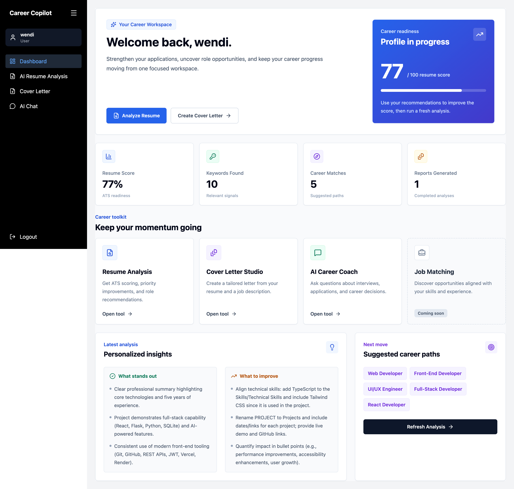
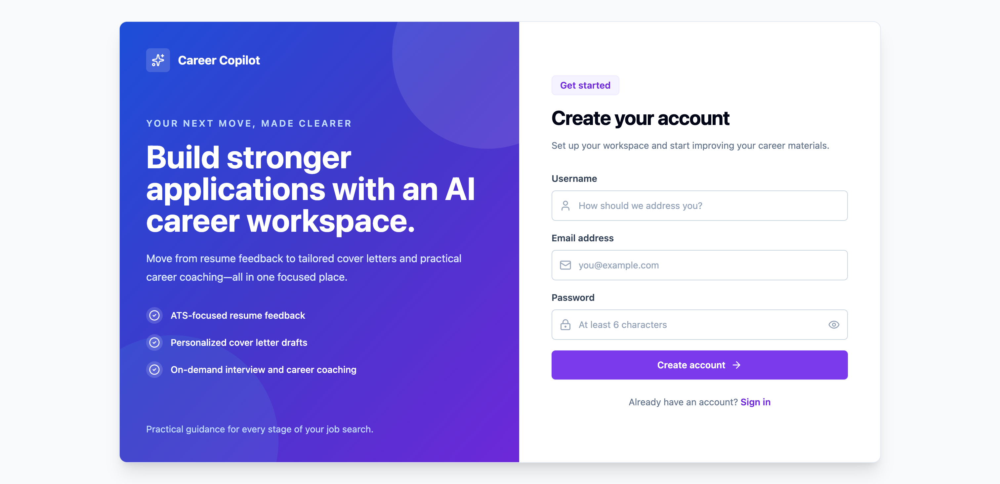
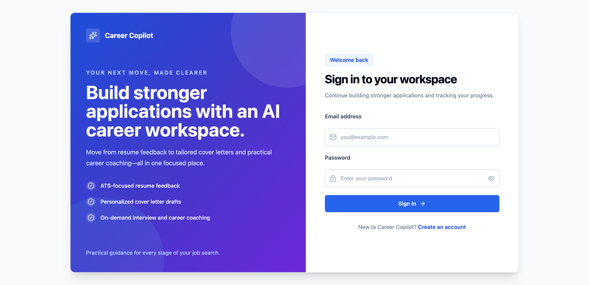
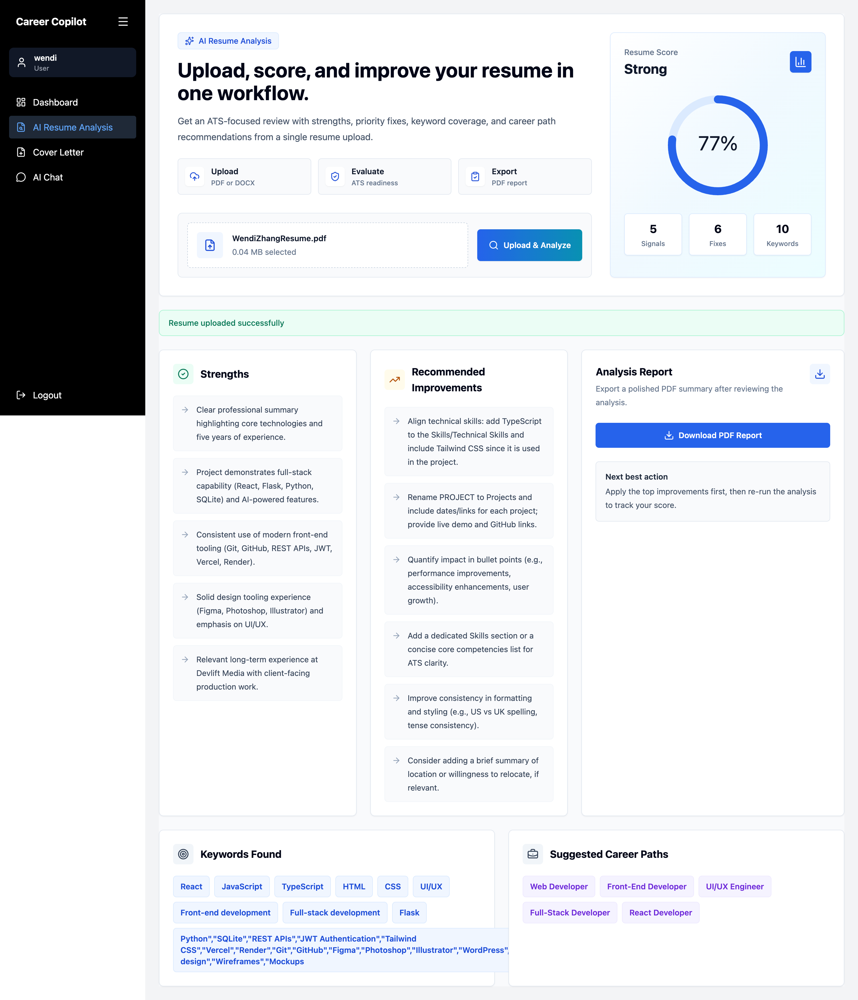
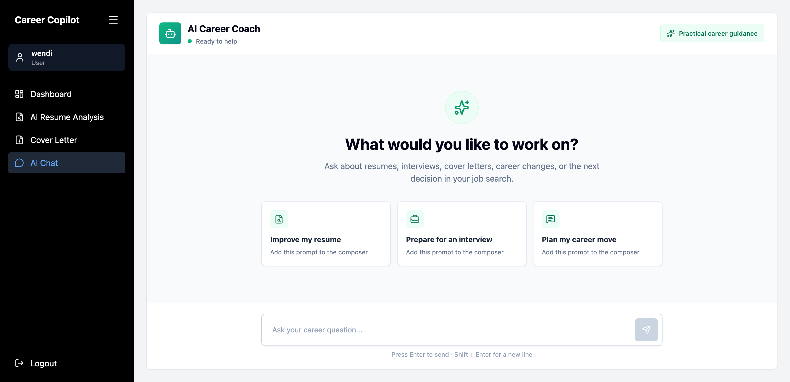
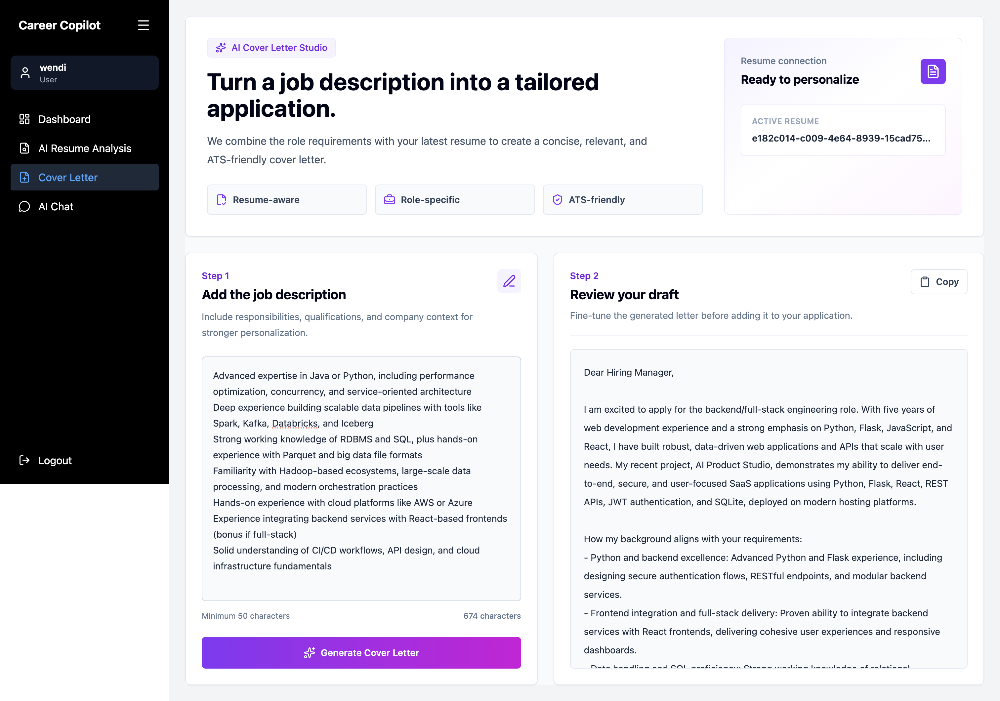

# 🚀 Career Copilot

Career Copilot is an AI-powered career assistant that helps job seekers improve their resumes, generate personalized cover letters, and receive AI career guidance.

** Live Demo:** https://career-copilot-ruby.vercel.app/

Built with React, TypeScript, Flask, JWT Authentication, SQLAlchemy, and the OpenAI API.

---

## Features

- User Registration & Login
- AI Career Chat Assistant
- Resume Upload (PDF/DOCX)
- AI Resume Analysis
- AI Cover Letter Generator
- Personal Dashboard
- JWT Authentication
- Resume Analysis History

---

## Tech Stack

### Frontend

- React
- TypeScript
- Vite
- Axios
- Bootstrap

### Backend

- Flask
- SQLAlchemy
- Flask-JWT-Extended
- OpenAI API
- SQLite

---

## Screenshots

### Dashboard



### Register



### Sign in



### Resume Analysis



### AI Chat



### Cover Letter



---

## Installation

### 1. Clone the repository

```bash
git clone https://github.com/WendiZhang/career-copilot.git
cd career-copilot
```
---

### Backend setup

```bash
cd backend

python -m venv venv
source venv/bin/activate

pip install -r requirements.txt

python app.py
```

---

### Frontend setup

```bash
cd frontend

npm install

npm run dev
```